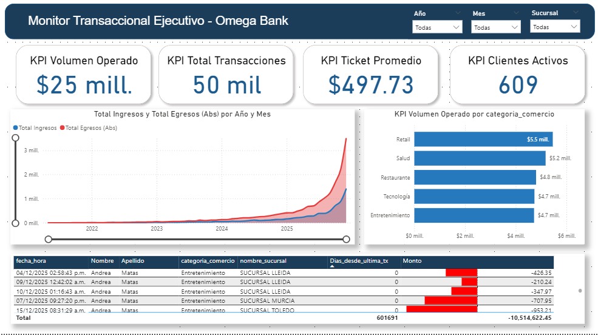

# 🏦 Omega Bank Analytics: Arquitectura de Datos en la Nube

> **Proyecto de Ingeniería de Datos End-to-End**: Desde la generación de datos sintéticos en Python hasta la visualización ejecutiva en Power BI, pasando por un Data Lakehouse en AWS.

## 📋 Contexto del Negocio
Omega Bank, una entidad financiera digital, enfrentaba dificultades para analizar su flujo de caja histórico debido a la dispersión de datos en archivos planos. El objetivo fue construir una arquitectura escalable que permitiera:
1. Centralizar la información transaccional.
2. Detectar fugas de liquidez en tiempo real.
3. Segmentar la cartera de clientes por comportamiento de riesgo (Churn).

## 🏗️ Arquitectura Técnica (AWS + Python + Power BI)
La solución se diseñó bajo el paradigma de **Separación de Cómputo y Almacenamiento**:

1.  **Ingesta (Python & S3):** * Script de generación de datos sintéticos (`Faker`) simulando transacciones bancarias complejas con integridad referencial.
    * Almacenamiento en **Amazon S3** (Capa Bronze/Raw).
2.  **Procesamiento (Amazon Athena):**
    * Transformación SQL para crear una **Capa Gold**.
    * Implementación de **Particionamiento (Año/Mes)** y formato **Parquet**, logrando una eficiencia de costos y lectura superior al 80% frente a CSVs tradicionales.
3.  **Analítica (Power BI):**
    * Conexión vía ODBC a AWS Athena.
    * Modelado en estrella (Star Schema) y medidas DAX para KPIs financieros.

## 📊 Insights y Hallazgos Clave

El análisis del dashboard reveló patrones críticos para la estrategia del banco:

### 1. Déficit Estructural de Flujo de Caja 📉
Al analizar la evolución temporal, se detectó que **los Egresos superan sistemáticamente a los Ingresos** durante todo el periodo 2024-2025. 
* *Diagnóstico:* La operatividad del banco depende excesivamente de productos de salida (Pagos/Compras) frente a productos de captación (Depósitos).
* *Acción:* Urge lanzar productos de inversión para equilibrar la balanza de liquidez.

### 2. Cartera de Consumo Diversificada 🛍️
A diferencia del principio de Pareto tradicional (80/20), el volumen transaccional muestra una distribución equilibrada entre las 5 categorías principales.
* **Retail** lidera con $5.5M, seguido de cerca por Entretenimiento ($4.7M).
* *Conclusión:* El banco tiene una base de clientes con hábitos de consumo saludables y variados, no dependiente de un solo sector.

### 3. Crecimiento Exponencial en 2025 🚀
Se identificó un cambio de tendencia agresivo al inicio de 2025, donde el volumen de operaciones crece exponencialmente comparado con la estabilidad de 2024. Esto valida el éxito de las recientes campañas de adquisición de usuarios simuladas en el sistema.

---

## 🛠️ Estructura del Repositorio

| Carpeta | Descripción |
| :--- | :--- |
| `/scripts/python` | Generador de datos (ETL Ingesta) |
| `/scripts/sql` | Consultas de transformación (Bronze -> Gold) |
| `/documentation` | Diccionario de datos y Paleta de colores |
| `Omega_Bank.pbix` | Archivo de Power BI con el modelo semántico |

## 🚀 Cómo replicar este proyecto
1.  Clonar el repositorio.
2.  Ejecutar `scripts/python/data_generator.py` para generar los CSVs.
3.  Subir archivos a un bucket S3.
4.  Ejecutar los scripts SQL en Amazon Athena en orden (01 -> 02 -> 03).
5.  Conectar Power BI mediante el conector ODBC de Simba Athena.

---
**Autor:** Paulo Zapata - Data Analyst / Engineer